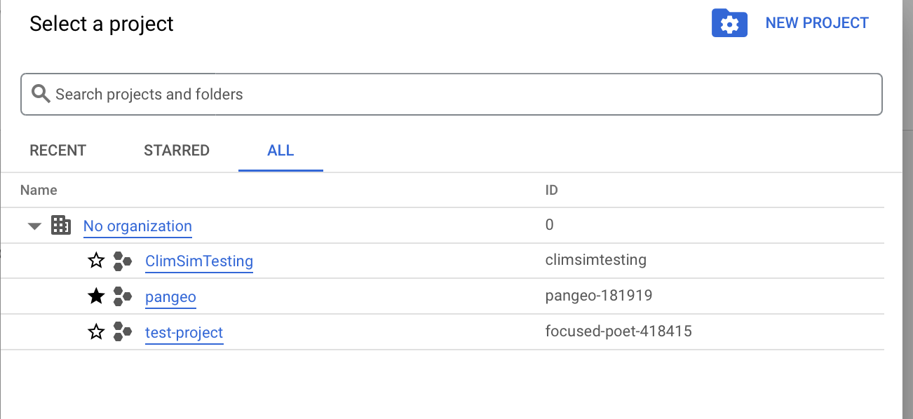
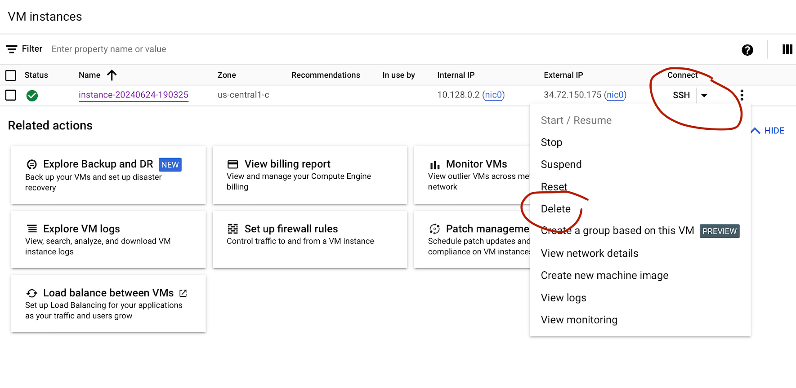

# (Experimental) Getting access to bare Cloud VMs

```{admonition} Important
---
class: important
---
This documentation should be considered highly experimental and permissions to follow these instructions are only given to a small subset of testers at the moment.
```

## Why?

We want to test e.g. containerized workflows that run climate simulations (for online testing of ML parametrizations). For that we need a 'bare' VM, and not the JupyterLab interface.

## Admin considerations

To fully separate this testing from the Hub etc we have created a separate project in Gcloud (same billing account and Org). To keep an eye on (e.g. accidental) cost overrun, I added a budget alert (in the linked billing account) that applies to all resources for this new project, and set a 500\$ alert with notifications at various thresholds. New users need the following IAM permissions:
- "Compute Admin"
- "Service Account User"

## How to get access

Send your email (private gmail preferred) to Julius Busecke

## Log into google cloud console and start a small test VM

- Use the email you sent above to sign into https://console.cloud.google.com
- Make sure to chose the project "ClimSimTesting" 
- Now navigate to "Compute Engine" and click on "Create New Instance". Chose a recognizable name (e.g. `climsim_<your_name>_test` and leave everything else on default for now and click "Create" at the bottom.
- After a short spin up you should see your VM instance with a green checkmark.
- Try to SSH into it via the cloud console (click on SSH on the far right).
- Let me know on slack that you were able to create an instance
- **Very Important**: Delete your instance after the test. **You should do this everytime you are done using the VM to avoid large costs**. Click on the triple dots on the right, and chose "Delete". 
