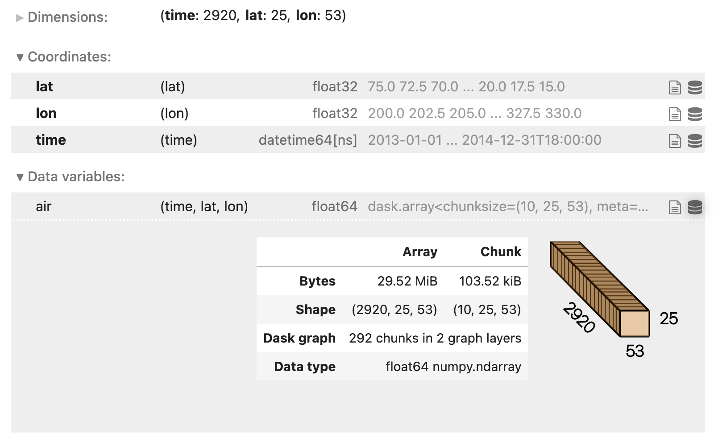

# Dask Guide

Dask can be deployed on distributed infrastructure, such as an HPC system or a cloud computing system. There is a growing ecosystem of Dask deployment projects that facilitate easy deployment and scaling of Dask clusters on a wide variety of computing systems.

Within LEAP JupyterHub, we can use the `dask-gateway` to create dask clusters.

## Introduction to Dask Gateway

Dask Gateway helps you manage Dask clusters for multiple users in a scalable, secure, and resource-efficient way. It's designed to work well in environments like JupyterHub or shared cloud infrastructure.

Rather than manually setting up a Dask cluster, Dask Gateway automates the process, letting you spin up resources on-demand without worrying about underlying infrastructure details.

## When to use Dask Gateway:

Dask Gateway is useful when:

- You need to run Dask jobs on a shared cluster.
- You want to scale your computation dynamically, particularly in cloud or HPC environments.
- You prefer not to manage the underlying infrastructure manually (e.g., node management, worker allocation).

## Quick start (Notebook)

This sequence connects to Dask Gateway, starts a cluster, attaches a client, and scales workers as needed.

```python
from dask_gateway import Gateway

# Connect to Gateway (preconfigured on the Hub)
gateway = Gateway()

# Inspect available cluster options (cores, memory, image, env vars)
gateway.cluster_options()

# Create a cluster
cluster = gateway.new_cluster()
cluster

# Connect a Dask client
client = cluster.get_client()
client

# Scale on demand (fixed size or adaptively)
cluster.scale(4)  # fixed size: set an explicit number of workers

cluster.adapt(
    minimum=1, maximum=20
)  # adaptively: autoscale between a min/max based on workload

# Link to the Dask dashboard for task graphs, memory, and progress
client.dashboard_link
```

!!! tip:

    The **Dask dashboard** visualizes work in real time (graphs, progress bars, worker memory). It's the best place to debug performance.

## Example: dask.array workload

This example shows how Dask splits a big array into chunks, builds a task graph, and only runs it when asked (lazy computation).

```python
import dask.array as da

# 20k x 20k random array, chunked into 1000 x 1000 tiles
# Chunking controls parallelism and memory per task
x = da.random.random((20_000, 20_000), chunks=(1_000, 1_000))
y = x + x.T
z = y[::2, 5000:].mean(axis=1)

# Compute once workers are ready (executes lazily until this line)
z.compute()
```

If the runtime is too long, then we can scale up:

```python
cluster.scale(8)  # add workers, then recompute
z.compute()
```

## Example: xarray + Zarr (GCS)

This example opens a remote Zarr dataset stored in Google Cloud Storage (GCS), builds a lazy analysis pipeline, and then executes it on a Dask cluster.

```python
import xarray as xr

# Zarr example on GCS
ds = xr.open_dataset(
    "gs://cmip6/CMIP6/HighResMIP/MOHC/HadGEM3-GC31-HM/highresSST-present/r1i1p1f1/3hr/tas/gn/v20170831/",
    engine="zarr",
    chunks={},
)

# Inspect and adjust chunking if needed
ds.chunks
ds = ds.chunk({"time": 240, "lat": 256, "lon": 256})

# Build a lazy pipeline: Area-weighted global mean, then a rolling mean along time
weights = np.cos(np.deg2rad(ds.lat))
tas_global = ds.tas.weighted(weights).mean(("lat", "lon"))
tas_rolled = tas_global.rolling(time=24, center=True, min_periods=12).mean()

# Trigger computation on the cluster
result = tas_rolled.compute()
print(result)
```

## Dask / Xarray tips and tricks

The Xarray docs have a page on Xarray + dask best practices [here](https://docs.xarray.dev/en/stable/user-guide/dask.html?utm_source=chatgpt.com#best-practices)

### Correct chunk sizes

When working with Xarray and Zarr, you should aim for data chunk sizes around **~100 MB** (rule of thumb: ~50–250 MB). Chunk sizes that are too small can overwhelm the Dask scheduler, while chunks that are too large can cause memory issues.

You can examine the chunk size and shape by viewing the HTML repr of an Xarray dataset in a Jupyter Notebook. If you click on the right-most database logo you should get a drop-down menu that shows the chunking information.



Good chunking balances memory, overhead, and parallelism:

- Aim for ~100 MB per chunk of array data (rule of thumb ~50–250 MB).
- Align chunks with the access pattern (e.g., chunk along time for time-wise operations).
- Rechunk explicitly when the store’s defaults aren’t ideal.

### Delay computation until write

Xarray is great at lazy computation; it’s usually possible to run multiple operations before any computation is done. Keep everything lazy (not eager!) until you finish your processing and write your data. For example, a `to_zarr()` call will trigger the computation. This can generally be accomplished by **not** calling `.load()`, `.persist()`, or `.compute()` during intermediate steps.

## Use the Dask dashboard

If you are using the Dask distributed scheduler you can view the Dask dashboard in a browser. This allows you to see memory usage, task progression, and a bunch of other metrics live.

```python
# Local / standalone scheduler:
from distributed import Client

client = Client()
client
```

On Dask Gateway (recommended on the Hub), you’ll typically do:

```python
# Using Gateway:
client = cluster.get_client()
client.dashboard_link
```

## Memory Management with Xarray and Dask

Running out of memory (OOM) is one of the most common issues when working with climate datasets, even on 128 GB workers.
Here are patterns to avoid and recommended alternatives.

**Pitfall: eager load + rechunk**

```python
import xarray as xr

# This will likely OOM!
ds = xr.open_dataset("bigfile.nc").load()
ds = ds.chunk({"time": 100})
result = ds.mean("time").compute()
```

Here `.load()` forces the full dataset into memory before chunking.

**Better: lazy rechunk + write + reload**

```python
# Open lazily with Dask
ds = xr.open_dataset("bigfile.nc", chunks={})

# Rechunk safely
ds_rechunked = ds.chunk({"time": 100})

# Write to Zarr
ds_rechunked.to_zarr("gs://leap-persistent/username/bigfile_rechunked.zarr")

# Reopen and process
ds2 = xr.open_zarr("gs://leap-persistent/username/bigfile_rechunked.zarr")
result = ds2.mean("time").compute()
```

This keeps memory use bounded.

### Processing subsets with .isel()

For very large data, process subsets explicitly and append:

```python
for i in range(6):  # e.g. nf = [0,1,2,3,4,5]
    ds_sub = ds.isel(nf=[i])  # brackets preserve dimension
    processed = my_processing(ds_sub)

    processed.to_zarr(
        "gs://leap-persistent/username/processed.zarr",
        mode="a",
        append_dim="nf",
    )
```

### Tips to avoid OOM

- Chunk around 100 MB per task
- Stay lazy until the end of workflow
- Use the Dask dashboard to monitor memory
- Scale workers with `cluster.scale()` or `cluster.adapt()`
- Write intermediates with .to_zarr() to checkpoint progress

!!! tip

    If you hit repeated OOM errors, try the subset-loop approach (isel + to_zarr with mode="a"). It trades some complexity for much more stability.

## Cleaning up

When, make sure to shut down your Dask cluster (scheduler + workers) so the compute nodes are released back to the shared Gateway pool. This stops your resource usage and frees capacity for others. Use the following code snippet to do this:

```python
client.close()
cluster.shutdown()
```

## Common issues and fixes

| Issue                               | Quick fixes                                                                                                                                                       |
| ----------------------------------- | ----------------------------------------------------------------------------------------------------------------------------------------------------------------- |
| **Workers killed / OOM**            | Increase worker memory; reduce chunk sizes; avoid creating huge numbers of tiny tasks; consider `ds = ds.chunk({...})` with larger chunks per task.               |
| **Slow progress**                   | Scale up workers with `cluster.scale(...)` or use `cluster.adapt(minimum=..., maximum=...)`; rechunk for bigger tasks; use `persist()` on reused intermediates.   |
| **Dataset not found / auth errors** | Verify the bucket/path; check credentials and permissions; confirm whether code is running on the Hub vs. local and that the selected interpreter/kernel matches. |
| **Dashboard not loading**           | Recreate the client/cluster, then reopen `client.dashboard_link`; ensure the dashboard URL isn’t blocked by network/firewall settings.                            |

## Other ways to run Dask

While Dask is a great tool for scaling, there are other ways to run Dask on distributed systems.

- HPC (job schedulers): https://jobqueue.dask.org/
- Dask MPI: https://mpi.dask.org/
- Managed cloud: https://coiled.io/
- Kubernetes: https://kubernetes.dask.org/en/latest/
- Cloud provider SDKs: https://cloudprovider.dask.org/en/latest/
