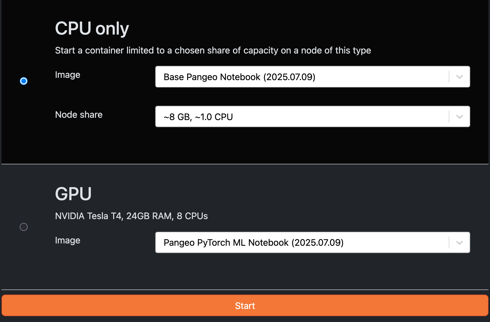

# Hub Access Overview

LEAP provides flexible ways to access its JupyterHub environment depending on your workflow preferences. You can:

- Access the Hub directly through a *web browser*
- Connect to the Hub using *VSCode on your local machine*
- Use a *VSCode interface inside JupyterLab* via the built-in extension

Each has its own trade-offs in setup, power, and user experience. This page will help you decide which method is right for you based on your workflow.

## TL;DR

| Method                     | Best For                                                 |
| -------------------------- | -------------------------------------------------------- |
| **Browser (JupyterLab)**   | New users, teaching, notebooks, simple experiments       |
| **VS Code inside the Hub** | Repo + notebook workflows, richer IDE, no setup          |
| **Local VS Code IDE**      | Power users who want full desktop performance & features |

## Method Comparison

### 1. **Browser (JupyterLab / Web UI)**

**Pros**

- Fastest onboarding, works from any machine
- Zero local setup or install
- Guaranteed environment parity with Hub compute
- Ideal for teaching, workshops, quick data exploration

**Cons**

- Not a full IDE (limited refactoring, Git UX, extensions)
- Multi-file repo workflows can feel clunky
- Fewer features compared to VS Code

**Use-cases**

- First-time users, classes, tutorials
- Notebook-centric workflows
- Reliable & consistent shared environments

See installation instructions here: [Access via Web Browser](hub_browser_access.md)

### 2. **VS Code Inside the Hub (browser-based VS Code extension)**

**Pros**

- Rich IDE in your browser tab
- No SSH setup or config
- Full access to your Hub environment (same kernel, filesystem, terminal)
- Easier repo navigation, Git workflows, split views, terminal + notebooks side-by-side

**Cons**

- Some extensions may be disabled/unavailable
- Slight lag in slower networks
- Not as fully integrated as local VS Code

**Use-cases**

- Daily IDE-like workflows on Hub compute
- Working with both notebooks and scripts in one place
- Collaborative work on shared repos

See installation instructions here: [Access VSCode inside the Hub](vscode_inside_hub.md)

### 3. **Local VS Code IDE Connected to the Hub**

**Pros**

- Richest developer experience (UI, extensions, keybindings)
- Ideal for long sessions and power-user workflows
- Full VS Code features, debugging, linting, Git integrations

**Cons**

- Setup can be fragile (SSH, token config, port-forwarding)
- Easy to mistakenly use your **local** interpreter/kernel
- Credentials or data may unintentionally end up stored locally
- More complex to support in classrooms/workshops

**Use-cases**

- Power users comfortable with remote dev tools
- Working on large codebases or long-running services
- Custom local workflows that the Hub can’t support directly

See installation instructions here: [Access via VSCode (external)](vs_code_to_hub.md)

## Installing Packages & Environment Behavior

| Behavior                               | Browser / VS Code in Hub                  | Local VS Code IDE                                     |
| -------------------------------------- | ----------------------------------------- | ----------------------------------------------------- |
| **Where packages install**             | On the Hub compute                        | Depends on interpreter—can be local or remote         |
| **Persistence across server restarts** | Yes, if installed in `$HOME` or Conda env | Same, if using remote interpreter                     |
| **Common pitfall**                     | None                                      | Accidentally installing locally instead of on the Hub |

!!! note

    Go to [Managing Software](manage_software.md) for more guidance on installing packages.

## Security & Data Movement

- *Browser and in-Hub VS Code*: data stays on the Hub unless explicitly downloaded
- *Local VS Code IDE*: easier to accidentally sync data to your local machine or expose secrets via cached credentials

!!! tip

    - You can switch between methods at any time - no need to stick to one. All methods access the same files in your Hub home directory

# Accessing the hub

## Browser

**https://leap.2i2c.cloud/hub/**

You can access the Hub by visiting `https://leap.2i2c.cloud/hub/` in your browser. This should bring you to a main menu where you can choose your cloud-compute resources and environment.

{ align=left }

## VSCode

Another option for accessing *The hub* is connecting with the IDE VSCode.

### Pre-requisites

- Register for a LEAP account to use the *The hub*. Details can be found on the [Introduction / Getting Started](../introduction/getting_started.md#registration) page.

- Install [websocat](https://github.com/vi/websocat) on your local machine.
    `pip install websocat` works on Mac OS, and pre-built binaries [are available](https://github.com/vi/websocat/releases)
    for all other operating systems.

- Install [VSCode](https://code.visualstudio.com/download) on your local machine.

- In VSCode, find and install the `Remote-SSH` and `Jupyter` extensions from the VSCode Extensions Marketplace.
    Remote-SSH will be used to connect to your LEAP Pangeo server, while the Jupyter extension will be used to open .ipynb notebooks and manage the kernel that runs your code on the remote server.

{ align=left }

{ align=left }

### Authentication Options

!!! note

    There are two levels of authentication – your **JupyterHub token** and your **SSH key pair** (public/private). This guide will walk you through both so you can connect with JupyterHub from your VSCode without entering a password.

#### JupyterHub token

The **JupyterHub token** is like a temporary password that lets your local machine talk to the JupyterHub server over a special channel (via websocat).

The JupyterHub token will be included in your `~/.ssh/config` file on your local machine so ssh knows how to talk to the server.

#### SSH key pair

Your **SSH key pair** is like a secure ID card. Your local machine holds the private key (secret), and the server holds your public key (the badge that proves it trusts you).

The SSH public key will be added to your GitHub account for convenience, and then downloaded onto the JupyterHub server (saved into `~/.ssh/authorized_keys`) so the server knows your local machine is trusted.

### Setup

#### 1 [Web Browser] Start your server

This setup only works after you start your JupyterHub server. So, start your server!
Please keep in mind that even after setting up Remote-SSH on your VSCode, you would have to start your server on [LEAP Pangeo](https://leap.2i2c.cloud/hub/home) before attempting to connect to the server.

#### 2 JupyterHub Token Setup

#### 2.1 [Web Browser] Obtain a JupyterHub Token

We will need to create a JupyterHub token for authentication.

1. Go to the JupyterHub control panel. You can access it via `File -> Hub control panel` in
    JupyterLab, or directly going to [https://leap.2i2c.cloud/hub/token](https://leap.2i2c.cloud/hub/token).

1. In the top bar, select **Token**.

1. Create a new Token, and keep it safe. **Treat this like you would treat a password to your
    JupyterHub instance**! It is recommended you set an expiry date for this.

#### 2.1 [Local Terminal] Configure local `~/.ssh/config` with the JupyterHub Token

We will set up our ssh config file to tell `ssh` how to connect to our JupyterHub. Add
an entry that looks like this to the end of your `~/.ssh/config` file (create it if it does not exist).

```
Host leap.2i2c.cloud
    User jovyan
    ProxyCommand websocat --binary -H='Authorization: token <YOUR-JUPYTERHUB-TOKEN>' asyncstdio: wss://%h/user/<YOUR-JUPYTERHUB-USERNAME>/sshd/
```

replace:

- `<YOUR-JUPYTERHUB-TOKEN>` with the token you generated earlier
- `<YOUR-JUPYTERHUB-USERNAME>` with your jupyterhub username

#### 3 SSH Key Pair Setup

#### 3.1 [Local Terminal] Generate a ssh key pair

1. Generate the key pair on local terminal by executing the command:

    `ssh-keygen -t ed25519 -C "your_email@example.com"`
    Make sure to replace your_email@example.com with your actual email address.

1. Add key to ssh-agent by executing:
    `eval "$(ssh-agent -s)"` and

    `ssh-add  #~/.ssh/id_ed25519`

1. Copy the public key:
    Use following command to show the public key on your local machine:
    `cat ~/.ssh/id_ed25519.pub`
    And copy the entire key, including the email address.

    Do not expose your private key `id_ed25519` - the private key should not be shared.

#### 3.2 [Web Browser] Save the public key on Github

1. Go to [Github key settings](https://github.com/settings/keys), then click on "New SSH Key."

1. Paste the copied public key (including email address) into the "Key" box, and save. In the next step, we will leverage Github to save your public key on JupyterHub.

#### 3.3 [Web Browser] Setup ssh keys on your JupyterHub server

1. Make sure your JupyterHub server is still running. If not, start a new one.

1. Open a terminal in JupyterLab on your web browser

1. Run the following commands:

    ```bash
    mkdir -p ~/.ssh
    wget https://github.com/<YOUR-GITHUB-USERNAME>.keys -O ~/.ssh/authorized_keys
    chmod 0600 ~/.ssh/authorized_keys
    ```

    replacing `<YOUR-GITHUB-USERNAME>` with your github username.

1. Verify that authorized_keys contains your key by running `cat ~/.ssh/authorized_keys` on the JupyterLab Terminal

1. If it is empty or nonexistent, then create the file authorized_keys in the ~/.ssh/ directory and paste your ssh public key (`cat ~/.ssh/id_ed25519.pub`, from local terminal) and save file.

With that, we are ready to go!

#### 3.4 [Local Terminal] Try `ssh`-ing into your JupyterHub!

After all this is setup, you're now able to ssh in! On your local terminal, try:

```
ssh leap.2i2c.cloud
```

and it should just work! If configured correctly, `leap.2i2c.cloud` should not ask you for a password.

!!! warning Debugging Help

    If you get the error `ssh: connect to host leap.2i2c.cloud port 22: Operation timed out`, then check you have installed websocat by running `run pip install websocat` and confirm that ther config file in the correct directory, `~/.ssh/config`

If the CLI asks for a password, please verify that your access token and public keys are valid and consistent across platforms and try the previous steps again. Keep in mind this test has to only work once, and it is not necessary to ssh into JupyterHub via CLI once you confirm this works once.

#### 5 [VSCode] Connect to LEAP Pangeo on VSCode

Launch VSCode, click on the top search bar to open the Command Palette (cmd + shift + P on Mac)

1. Enter `>Remote-SSH: Add New SSh Host`


1. Enter `ssh leap.2i2c.cloud`


1. Click on the first option, /Users/\<your_local_username>/.ssh/config


1. Follow further prompts until you are connected. You should see this on your top bar once you are connected.


1. Click on "Open Folder" and select the home directory. You should be able to access your LEAP-Pangeo Notebooks remotely now.


## 6 [VSCode] Write / execute your code via a remote kernel

1. Once you open a Notebook, you will find a selection menu for a kernel on the top-right.


1. Select the option "Python Environments"


1. Selected the recommended `conda (Python 3.x.x)` kernel


You should now be good to execute code via remote kernel on the LEAP server from local VSCode!

#### 7 [VSCode] Re-connecting to Remote SSH After Setup

1. Type `>Remote-SSH: Connect to Host` into the top search bar.


1. Select `leap.2i2c.cloud`. Keep in mind this action will only work if the [2i2c Server](https://leap.2i2c.cloud/hub/home) is already active.


1. Repeat the steps from _"Write / execute your code via a remote kernel"_

Contributors to this documentation:

1. Yuvi [https://github.com/yuvipanda], [jupyter-sshd-proxy](https://github.com/yuvipanda/jupyter-sshd-proxy/blob/main/README.md):
1. Joe Ko [jk4730@columbia.edu], clarifications on how to setup the local public key
1. Sungjoon Park [sp4050@columbia.edu], whom you can contact for questions regarding this workflow
