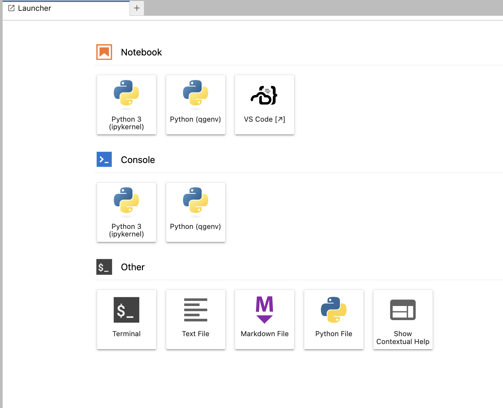

# Accessing the LEAP Hub via VS Code (in your browser)

The LEAP JupyterHub includes a browser-based version of Visual Studio Code, allowing you to use a full-featured IDE directly in your web browser, without any local installations.

This version of VS Code runs on the same remote server as your Jupyter kernel and filesystem — so any code or terminal work is happening *in the cloud*, on LEAP compute infrastructure.

## How to Launch VS Code in Your Browser

1. **Log into the LEAP Hub**

    - Go to the [LEAP JupyterHub](https://leap.2i2c.cloud/) browser and sign in using your institutional credentials.

1. **Start your server (if it's not already running)**

    - Choose a server configuration and click **Start**.

1. **Click the VS Code Icon**

    - Once your Jupyter environment launches, look in the **Launcher** tab
    - Find and click the **VS Code** icon (it should look like the following screenshot).
        
    - This opens the in-browser VS Code interface in a new tab or within the same window.

1. **Using VS Code in the Browser**

    - You can open folders, edit files, and run terminals just like in the desktop app.
    - Use the **file explorer** on the left to navigate your directory.
    - Open a terminal: `Terminal` > `New Terminal` (runs in the same environment as Jupyter).
    - Start or open notebooks: click `.ipynb` files and they’ll open using the built-in Jupyter extension.
    - Git features, syntax highlighting, search, multi-file editing, etc. are all supported.

## Tips

- **Python environment**: Your Python interpreter is automatically set to the remote Hub environment.
- **Installing packages**: Use the built-in terminal and `pip install` or `mamba install`. These packages be added to your base environment.
- **Save your work**: Changes persist on the Hub’s file system — no need to worry about syncing with your local machine.

## Common Issues

- **Missing extensions**: Some VS Code Marketplace extensions may not be available. This is a limitation of the server-based VS Code.
- **Lag**: If your internet connection is slow, performance may be less smooth than the desktop version.
- **VS Code doesn’t launch?** Try restarting your Jupyter server, or clear your browser cache and reload.
