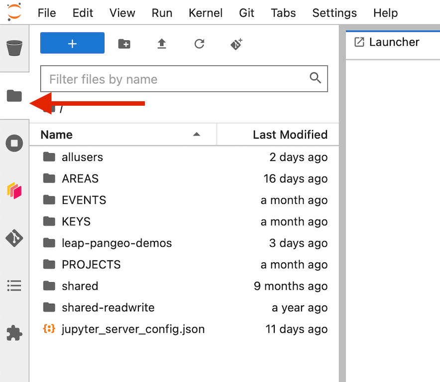
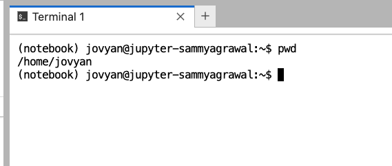

# Where Data Lives

This guide is intended to help users make intelligent long-term design decisions about what they want to do with their data and where they want to keep it. At a very high level, your data can live "locally" in your JupyterHub User Directory, in a public cloud bucket, or on a "private" server (HPC Filesystem or local machine).

- Data being *used* or consumed by third parties best belongs in the OSN Pod, linked to the data catalog.
- Data being *processed* actively during analytical science workflows should live in the LEAP Cloud buckets in conjunction with the Hub.
- Data being *generated* will likely exist privately on HPC systems if in the form of large numerical simulations.

# User Directory

When you open your hub, you can navigate to the file browser and see all the files in your User Directory



Your User Directory behaves very similar to a filestystem on your computer. If you save a file from a notebook, you will see it appear in the File Browser (you might have to wait a few seconds or press refresh) and you can use a terminal to navigate the terminal and manipulate files as you would on a UNIX machine:



!!! note
As shown in the picture above, every user will see `'/home/jovyan'` as their root directory. This
is different from many HPC accounts where your home directory will point to a directory with your username. But the functionality is similar. These are *your own files* and they cannot be seen/modified by other users (except admins).

!!! warning
To accommodate the expanding LEAP community, the data and compute team has instituted a storage quota on individual user directories `/home/jovyan`.
Your home directory is intended only for notebooks, analysis scripts, and small datasets (< 1 GB).
It is not an appropriate place to store large datasets.
Unlike the cloud buckets, these directories use an underlying storage with a rigid limit. If a single user fills up the space, the Hub crashes for everyone.
We recommend users use less than 25GB and enforce a hard limit of 100GB, which may decrease.

`````
````
```
To check how much space you are using in your home directory open a terminal window on the hub and run `du -h --max-depth=1 ~/ | sort -h`.

If you want to save larger files for your work, we recommend using cloud storage. See the [FAQs](../technical-reference/faqs.md) for guidance on reducing storage.
```
````
`````

# Cloud Storage

Our platform is centered around cloud data. LEAP owns two Google Cloud buckets (leap-persistent and leap-scratch) and also has an allocation of storage on an OSN pod.

1. For "internal" use, i.e. during the research process, we recommend users use the JupyterHub in conjunction with LEAP Cloud buckets (AKA GCS)
1. For publishing or sharing data externally (i.e. in conjunction with a released paper), we recommend pushing to OSN Pods.
   A common workflow is for data to be private --> get ingested to LEAP GCS --> OSN Pods for publication.

## LEAP-Pangeo Cloud Buckets

LEAP-Pangeo provides users two cloud buckets to store data. The JupyterHub is automatically authenticated to read from any of these buckets but write access might differ (see below). See [Authentication](../technical-reference/authentication.md) for details on how to access buckets from 'outside' the JupyterHub.
Google cloud is structured such that it is very easy and cheap to move data *into* the buckets, but there are high egress fees for taking data out of GCP Infrastructure. Taking data out means both writing from GCP to outside and reading from an external source like an HPC.
!!! tip
TLDR: Use the LEAP GCS buckets when you are actively doing science using the JupyterHub. If you wish to share some kind of finished product with the world, it is best to "publish" the data by moving outside GCS into OSN.

- `gs://leap-scratch/` - Temporary Storage deleted after 7 days. Use this bucket for testing and storing large intermediate results. leap-scratch is also a great staging area to use while ingesting data to some other permanent location.
- `gs://leap-persistent/` - Persistent Storage. Use this bucket for storing results you want to share with other members or access consistently from the Hub.

Files stored on each of those buckets can be accessed by any LEAP member, so be conscious in the way you use these.

- **Do not put sensitive information (passwords, keys, personal data) into these buckets!**
- **When writing to buckets only ever write to your personal folder!** Your personal folder is a combination of the bucketname and your github username (e.g. \`gs://leap-persistent/funky-user/').

GCS is great if:
\- You want to move data from your Jupyter-Hub home directory to the cloud.
\- You don't need the data to be accessed outside of the Jupyter-Hub.
\- This data is a work-in-progress and might be regenerated or modified as you do your science.

## Open Storage Network (OSN) Pod

The [Open Storage Network](https://www.openstoragenetwork.org/) is a federally funded distributed cloud storage for the research community. LEAP has a ~1 petabyte allocation on OSN, which is divided into projects and buckets. Projects are used to give additional users access to the Coldfront Admin Console, whereas buckets are how storage is administered up on the Pod. A project can have multiple buckets.

There are currently 3 principal Projects on the Pod:

- `'leap-pangeo'`: Used for Data Ingestion across the m2lines and LEAP community
  - Buckets:
    - `'leap-pangeo-manual'`: **No write access for users**
    - `'leap-pangeo-pipeline'`: **No write access for users**
    - `'leap-pangeo-inbox'`: *Write access can be shared with users who want to add data e.g. from an HPC center*
- `'m2lines'`: Used for project data and publications from the m2lines project
  - Buckets:
    - `'m2lines-pubs'`: **No write access for users**
    - ... various project buckets
- `'leap'`: Used for project data and publications from the LEAP project
  - Buckets:
    - `'leap-pubs'`: **No write access for users**
    - ... various project buckets

OSN allows s3-like cloud storage that has no egress fees, which means that you can share data with the public or outside colaborators without any cost per request! The downside of course is that the JupyterHub is not configured to interact with OSN as seamlessly as the GCS buckets.

Data can be transferred from `leap-pangeo-inbox` to `leap-pangeo-manual` with [this rclone github action](https://github.com/leap-stc/data-management/actions/runs/11167922927/workflow).

OSN is great if:
\- You want your data to be publicly accessible outside of the Jupyter-Hub.
\- You need to move data from your Jupyter-Hub home directory to more persistent storage.
\- You data does not fit into the Zarr model.

To migrate data to OSN, please contact the data-and-compute team on slack. They will contact the OSN pod admin and share bucket credentials for the `'leap-pangeo-inbox'` bucket. More details are provided under [authentication](../technical-reference/authentication.md).

# Private Storage - HPC or External Filesystems

There are scenarios in which it probably does not make sense to migrate your data into the cloud!

- If you have a powerful HPC system that produces extremely large volumes (petabytes) of data for processing, the LEAP infrastructure is currently not equipped to handle this.
