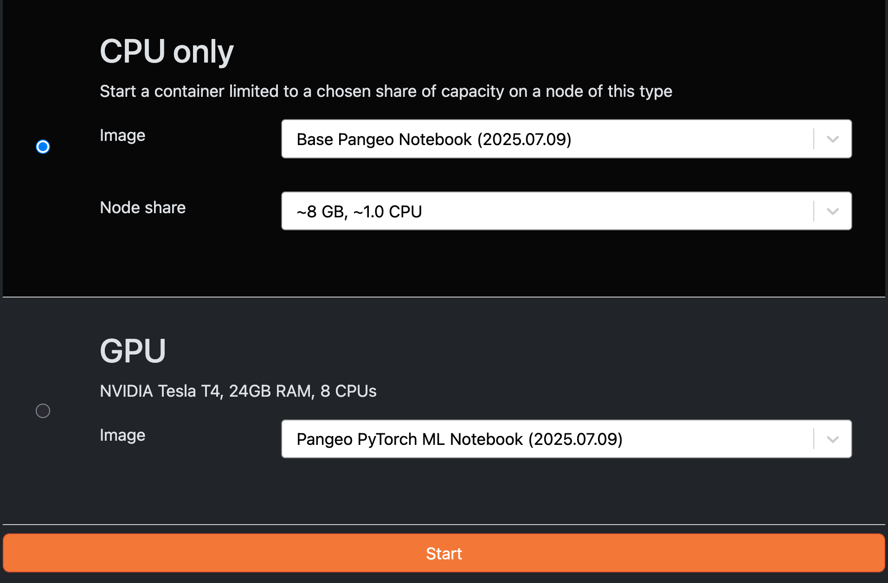

# Getting Started

## Registration

## Gaining Access

To gain access to the Hub please apply via our [Application Form](https://forms.gle/RpeaMZh5btTdZtzu8). Access to the JupyterHub is implemented via the [leap-stc](https://github.com/orgs/leap-stc/teams) GitHub organization. Each membership tier is associated with a Github Team and determines the resources available to the user.

| Tier                     | Github Team                                                                               | Resources Available                                                                                        | Intended for                                                                                     |
| ------------------------ | ----------------------------------------------------------------------------------------- | ---------------------------------------------------------------------------------------------------------- | ------------------------------------------------------------------------------------------------ |
| **EDUCATION**            | [leap-pangeo-base-access](https://github.com/orgs/leap-stc/teams/leap-pangeo-base-access) | Access to storage and computing resource up to 4 cores and 32GB RAM on JupyterHub servers.                 | Participants in LEAP Education programs (e.g., Bootcamp, academic courses, and summer programs). |
| **RESEARCH**             | [leap-pangeo-full-access](https://github.com/orgs/leap-stc/teams/leap-pangeo-full-access) | Access to storage and computing resource up to 16 cores and 128GB RAM on JupyterHub servers + GPU options. | Researchers who have been referred by a LEAP scientist. Six month renewal application required.  |
| **LEAP-FUNDED RESEARCH** | [leap-pangeo-full-access](https://github.com/orgs/leap-stc/teams/leap-pangeo-full-access) | Access to storage and computing resource up to 16 cores and 128GB RAM on JupyterHub servers + GPU options. | Researchers receiving LEAP funding.                                                              |

Once you have applied for membership, it will take a few days until you can be approved. Please watch out for email from LEAP that contains instructions on how to proceed.

!!! note

    It is very common for users to not realize that they have already received an invitation to join the `leap-stc` Github Organization! If you are unsure whether your membership has gone through, please consult our [FAQs][faqs]

## Logging In

1. Navigate to <https://leap.2i2c.cloud/> and click the **Log in to continue** button.
1. You will be prompted to authorize a GitHub application. Say **yes** to everything.
    You must belong to the appropriate GitHub team in order to access the hub.
1. You will redirected to a screen with server configuration options. Several drop down menus enable users to choose their environment image (default is Base Pangeo Notebook") and compute resources (CPU, GPU if enabled).
    
1. After clicking **Start**, wait for your server to start up. It can take up to few minutes.

!!! note

    Depending on your [membership] tier you might see different options (e.g. GPU might be hidden).

## Resource sizing

When starting a VM on the JupyterHub you have multiple configuration options.

- **Software environment ("Image")** - Which software environment to use. The default, *_Base Pangeo Notebook_* contains many commonly used earth science python libraries. You can also supply your own custom docker image.

- **VM size ("Node share")** - How many cpu cores and amount of memory.

- **VM type** - CPU or GPU focused VM.

!!! note

    **⚠️The GPU images should be used only when needed to accelerate model training.**

If unsure which options to choose, check out our guide on [scaling compute][compute-scaling].

## JupyterLab

After your server fires up, you will be dropped into a JupyterLab environment. From here you can open your own shell terminals, write scripts, and create iPython Notebooks! You also have seamless access to multiple [cloud storage options][where-data-lives] adjacent to your compute resources.

If you are new to JupyterLab, you might want to peruse the [user guide](https://jupyterlab.readthedocs.io/en/stable/user/interface.html).
