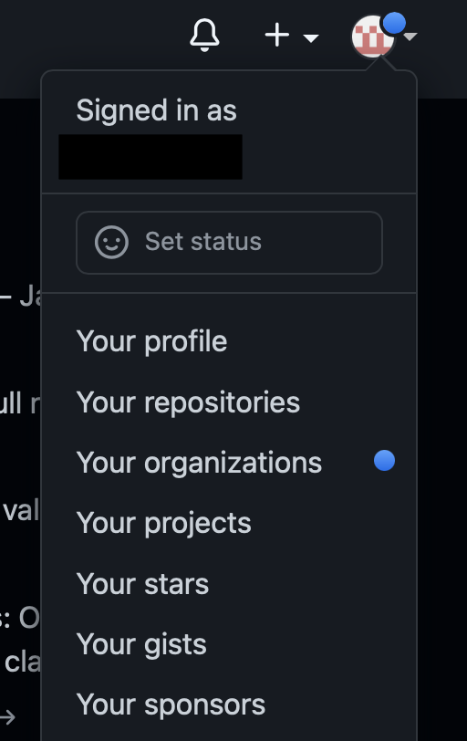

# Sign-up Troubleshooting

Before we begin, please ensure you have filled out the **[LEAP membership form](https://forms.gle/RpeaMZh5btTdZtzu8)** with the correct information.

## Where is my Github invite?

### Method 1

Please check your email account (**the one you used to sign up for the Github account you listed in the membership form** - independent of the email you use for LEAP) for an invite that looks similar to this:

Click the link and accept all invites.

### Method 2

Alternatively, you can log into your Github account, and you will see a notification in the top right menu under the "Organizations" tab.

You can follow that and accept the invitation there aswell.

## Filled out the form, but I did not get an invite?

In this case, it is most likely that you made a typo when filling out the membership form. Please fill it out again [here](https://forms.gle/RpeaMZh5btTdZtzu8), and wait a day before checking your inbox for an invite. If you need access ASAP, please alert your instructor or contact the [Data & Compute Team][contact] to get access.
